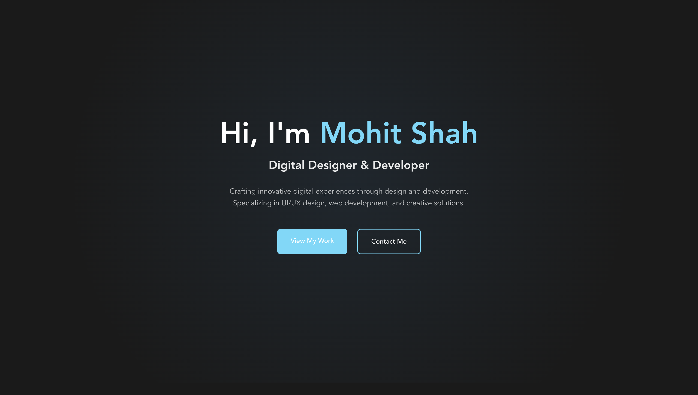

# Portfolio Website

A modern, responsive portfolio website built with React.js, featuring a sleek design, smooth animations, and an interactive skills showcase.



## 🌟 Features

- **Modern Design**: Clean, minimalist interface with a dark theme
- **Responsive Layout**: Fully responsive design that works on all devices
- **Interactive Elements**: 
  - Smooth scroll animations
  - Parallax effects
  - Hover animations
  - Custom cursor
- **Skills Showcase**: 
  - Grid layout with categories
  - Interactive skill cards
  - Visual progress indicators
- **Contact Form**: Integrated contact form with validation
- **Performance Optimized**: Fast loading times and smooth transitions

## 🛠️ Technologies Used

- **Frontend Framework**: React.js
- **Styling**: 
  - CSS3/SCSS
  - CSS Variables
  - Flexbox & Grid
- **Animations**: 
  - ScrollReveal
  - CSS Transitions
  - Custom Parallax
- **Icons**: Font Awesome
- **Development Tools**:
  - Vite
  - ESLint
  - Prettier

## 🚀 Getting Started

### Prerequisites

- Node.js (v14 or higher)
- npm or yarn

### Installation

1. Clone the repository
```bash
git clone https://github.com/yourusername/portfolio-website.git
```

2. Navigate to the project directory
```bash
cd portfolio-website
```

3. Install dependencies
```bash
npm install
# or
yarn install
```

4. Start the development server
```bash
npm run dev
# or
yarn dev
```

5. Open [http://localhost:5173](http://localhost:5173) in your browser

## 📁 Project Structure

```
portfolio-website/
├── public/
│   ├── assets/
│   │   └── images/
│   └── favicon.ico
├── src/
│   ├── components/
│   │   ├── About.js
│   │   ├── Contact.js
│   │   ├── Footer.js
│   │   ├── Header.js
│   │   ├── Home.js
│   │   ├── Skills.js
│   │   └── Work.js
│   ├── styles/
│   │   ├── main.scss
│   │   └── variables.scss
│   ├── App.js
│   └── main.js
├── package.json
└── README.md
```

## 🎨 Customization

### Colors
The color scheme can be customized by modifying the CSS variables in `src/styles/variables.scss`:

```scss
:root {
  --background-color: #0f0f0f;
  --text-color: #ffffff;
  --accent-color: #3498db;
  --secondary-color: #2c2c2c;
}
```

### Content
- Update personal information in respective component files
- Modify skills in `src/components/Skills.js`
- Update work projects in `src/components/Work.js`
- Edit contact information in `src/components/Contact.js`

## 📱 Responsive Design

The website is fully responsive with breakpoints at:
- Mobile: < 480px
- Tablet: < 768px
- Laptop: < 992px
- Desktop: ≥ 992px

## 🔧 Performance Optimization

- Lazy loading of images
- Optimized animations
- Minified CSS/JS
- Efficient component rendering

## 🤝 Contributing

1. Fork the repository
2. Create your feature branch (`git checkout -b feature/AmazingFeature`)
3. Commit your changes (`git commit -m 'Add some AmazingFeature'`)
4. Push to the branch (`git push origin feature/AmazingFeature`)
5. Open a Pull Request

## 📄 License

This project is licensed under the MIT License - see the [LICENSE](LICENSE) file for details.

## 👤 Author

**Mohit Shah**
- GitHub: [@caspermohit](https://github.com/caspermohit)
- LinkedIn: [Mohit Shah](https://www.linkedin.com/in/mohitshah7/)
- Twitter: [@mohitsh54078806](https://x.com/mohitsh54078806)
- Instagram: [@mohit__shahh](https://www.instagram.com/mohit__shahh/)

## 🙏 Acknowledgments

- [React.js](https://reactjs.org/)
- [Font Awesome](https://fontawesome.com/)
- [ScrollReveal](https://scrollrevealjs.org/)
- [Vite](https://vitejs.dev/)